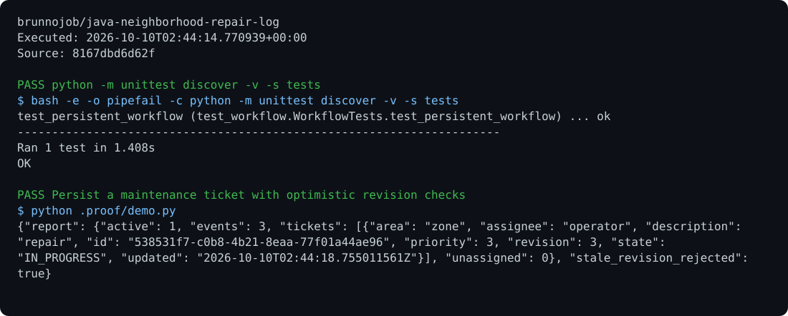

# Repair Log

Request management with priorities, assignees, state transitions, expected revisions, and a persistent event history.

## Run

Requirements: Java 17.

```sh
javac RepairLog.java
java RepairLog reparos.log add centro 3 "Reparar luminária"
java RepairLog reparos.log report > result.json
```

## Behavior

Commands: `assign id revision operator`, `transition id revision state reason`, and `report`. States: OPEN, ASSIGNED, IN_PROGRESS, RESOLVED, and CLOSED. Replay verifies the revision sequence and SHA-256 chain.

## Optional report archive

Use the [native C operations archive client](https://github.com/brunnojob/vercel-home-telemetry-api/tree/main/clients/c) to queue `result.json` under project `java-neighborhood-repair-log`. The client uses `BRUNNODEV_ACCESS_TOKEN` and retains unacknowledged reports locally.

## License

Original source and documentation are MIT licensed; see [LICENSE](LICENSE). Third-party dependencies and media retain their respective terms. Maintained by [Brunno Dev](https://brunnodev.store).

## Implementation update

Report summaries include active requests and unassigned open requests, keeping actionable workload separate from closed history.

Contribution trailer: `Co-authored-by: nyctophile <329826984+ineedfoundmyway@users.noreply.github.com>`.

## Execution proof

[](https://github.com/brunnojob/java-neighborhood-repair-log/actions/workflows/proof.yml)



[Verified run](https://github.com/brunnojob/java-neighborhood-repair-log/actions/runs/38018041879) · [Execution report](docs/proof/evidence.json)

Run `python .proof/record.py` after installing the prerequisites above. The scenarios execute repository code and verify exit codes and expected output. CI publishes `execution-proof` with the transcript, input fingerprints and source commit. The downloadable report identifies the exact tested version; the workflow badge tracks the latest run.
